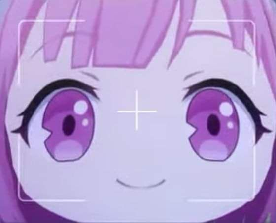
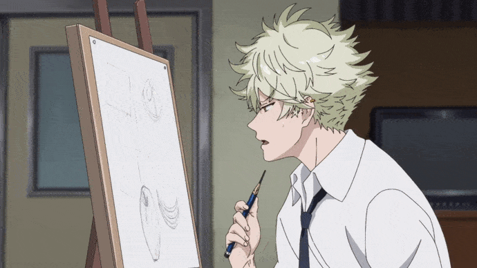

<table>
  <tr>
    <td></td>
    <td><//></td>
    <td><//></td>
  </tr>
</table>

 
<h1>a good painter will not just paint.</h1>
<h3>About Me</h3>

Hey there, I’m Muhammad Indrawan Ismail, a 3rd-semester Information Systems student at Sultan Aji Muhammad Idris University Samarinda. I love gaming, especially Mobile Legends and Genshin Impact. But right now, my phone is already six years old and I haven’t replaced it yet, and my Ryzen 5 laptop isn’t strong enough to run the games I usually play.

I’ve been spending most of my time coding. Honestly, I didn’t really know what to do during my holidays, so I just ended up coding. For me, coding feels like a new game  it’s challenging and makes me curious to keep learning. I like do the hard things until the easy one felt boring.

I can’t dance (definitely not DJ either), and I’m not that good at speaking, but I’m pretty good with crayons. 

"So much complexity in software comes from trying to make one thing do two things."

-Ryan Singer

"stubborn on the vision"

to build product build something people want, to make art make something "you" want

<picture>
Built by [Muhammad Indrawan](https://indrawan-id.vercel.app) - Fullstack Web Developer
