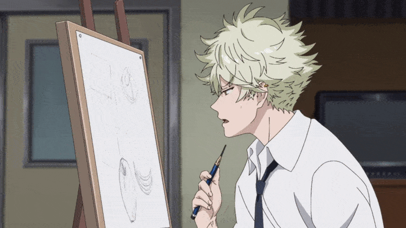

<table>
  <tr>
    <td></td>
    <td><//></td>
    <td><//></td>
  </tr>
</table>

 
<h1>SUPERMAN WEB</h1>
<h3>About Me</h3>

Hey there, I’m Muhammad Indrawan Ismail, a 4th-semester Information Systems student at Sultan Aji Muhammad Idris University Samarinda. I', a fullstack developer but mostly work on backend.

I’ve been spending most of my time coding. Honestly, I didn’t really know what to do during my holidays, so I just ended up coding. For me, coding feels like a new game  it’s challenging and makes me curious to keep learning. I like do the hard things until the easy one felt boring.

I can’t dance (definitely not DJ either), and I’m not that good at speaking, but I’m pretty good with crayons. 

"So much complexity in software comes from trying to make one thing do two things."

-Ryan Singer

<h2 align="center">profile visitors</h2>

  

Built by [Muhammad Indrawan](https://indrawan-id.vercel.app) - Fullstack Web Developer
